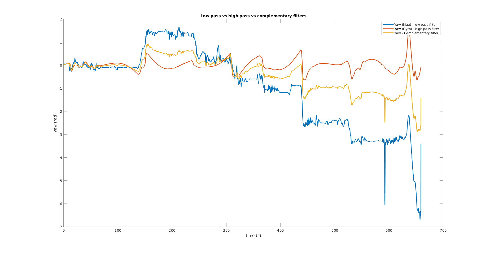

# Details
This assignment involved building a basic navigation stack using two sensors: a BU-353 GPS and a VectorNav VN-100 IMU. The main focus was on calibrating and analyzing the IMU data.

The GPS and IMU data were collected by using the NUANCE car and driving it around the campus.

# IMU

An IMU, or Inertial Measurement Unit, measures acceleration and angular velocity in its local frame.

The VN 100 is a 9 DOF (Degree of Freedom) sensor, consisting of an accelerometer, gyroscope, and magnetometer.

# Dead Reckoning

The following steps were followed to calibrate the IMU data and use it for dead reckoning:

1. ROS driver: A custom ROS driver was developed to read the IMU and GPS data from the serial port and publish it to ROS topics in custom ROS message formats.

2. Magnetometer Calibration: 
This step was done to negate the effects of interference due to nearby ferromagnetic materials (hard iron calibration) and distortion due to
materials that influence the magnetic field but do not necessarily produce one (soft iron calibration).

3. Complementary Filter:
A complementary filter was implemented to combine magnetometer and gyroscope data, providing a more accurate estimate of the sensor's orientation.

4. Dynamic Bias Removal:
 During data collection, the car occasionally stopped in traffic, resulting in zero velocity regions on the GPS velocity plots. However, the acceleration readings showed noisy data during those intervals. As the acceleration was integrated, the velocity increased uncontrollably. This was solved by dynamically calculating the bias correction using GPS velocity.

5. Dead Reckoning:
Velocity and position were calculated by integrating acceleration and velocity, respectively. The position was initialized at (0,0), and the velocity was initialized with the first GPS velocity reading. The IMU and GPS trajectories were analyzed to determine the error in IMU dead reckoning and understand the drift in the IMU data.

